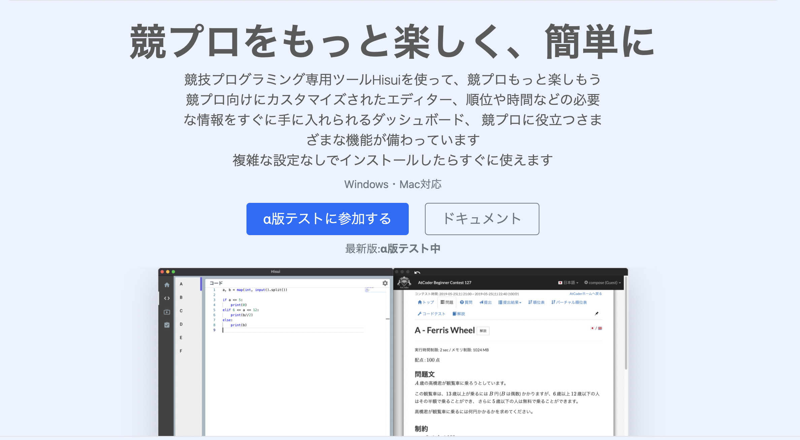

## Hisui について

[紹介ページ](https://adenohitu.github.io/Hisui-introduce/)  

「Hisui」は競技プログラミングサポートツールです。  
競プロの万能ツールのようなものです。

## Hisui の目標

#### 複雑な競技プログラミングの環境をこれひとつで完結させることができる

複雑な環境構築などの作業をなしで、競プロを始められる。  
 コーディングから提出まで一つのアプリケーション内で完結できる。

#### 既に環境がある人に向けて、さらに便利になるようなツールの提供

「問題を解く」ことや「誰かと競争する」という競技プログラミングの醍醐味をもっと楽しむための機能を提供。
