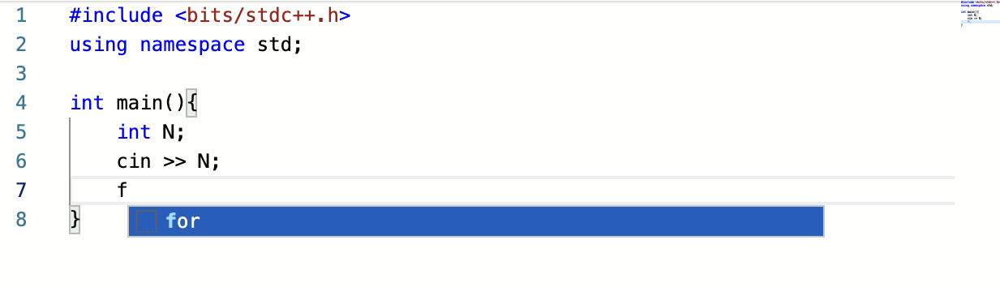
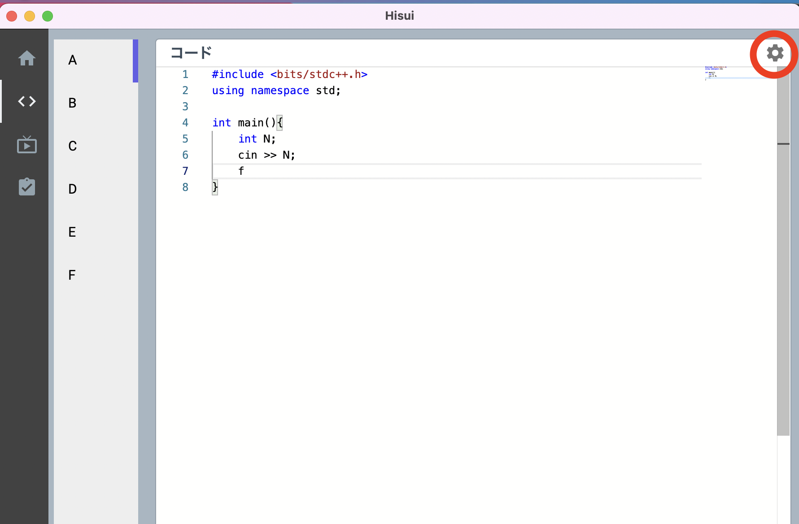
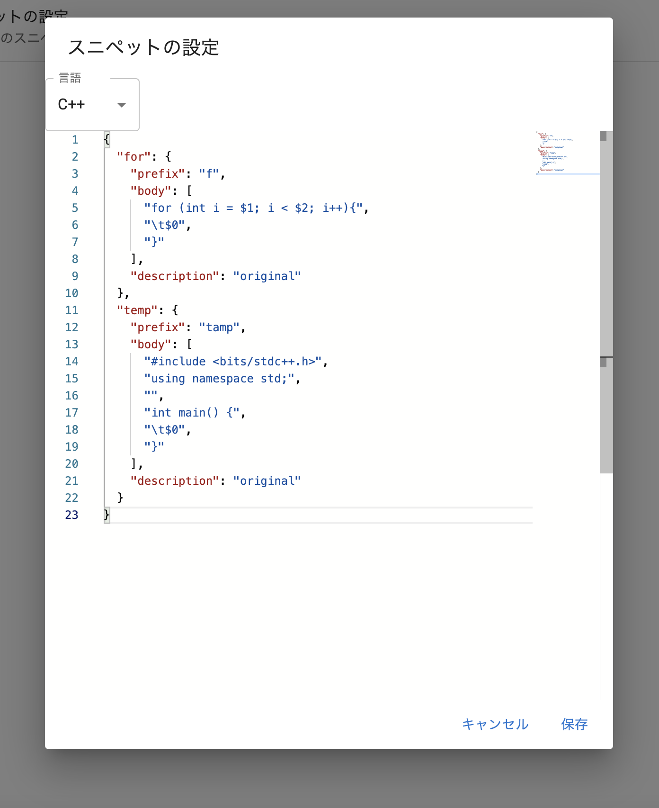

スニペットに**よく使う記法**などを事前に設定することで、コーディングする時に呼び出し,補完することができます。  
またVSCodeと似た記法になっており、条件を満たせば VSCode からスニペットをそのまま移植、または VSCode へスニペットを移植することもできます。

<details>
  <summary>今後の機能の追加</summary>
  今後 VSCode と全く同じ記法が使えるようにする予定です。
  <br />
  また、簡単に設定できるようなツールも提供予定です
  <br />
  言語のエラー表示などにも対応予定です
</details>

例:「f」と打って for のスニペットが呼び出されている様子


<details>
  <summary>VSCodeからの移植方法（応用）</summary>
  VSCodeのスニペットは"JSON with Comments"という記法で書かれています。これはJSONにコメント等を追加したものです。
  コメントを削除することで、JSONの記法となり、Hisuiにスニペットを移植することができます。
</details>

## 追加方法

#### 1. 右上の設定マークをクリック



#### 2. 設定リストの中からスニペットの設定を選択

#### 3. 言語を指定したのち、下の記入例に従ってスニペットを設定する



#### 4. 保存する

これでスニペットの設定は完了です。

## 記入例(C++)

<!-- prettier-ignore -->
```json
{
  "for": {
    "prefix": "f",
    "body": [
      "for (int i = $1; i < $2; i++){",
      "\t$0",
      "}"],
    "description": "original"
  },
  "temp": {
    "prefix": "tamp",
    "body": [
      "#include <bits/stdc++.h>",
      "using namespace std;",
      "",
      "int main() {",
      "\t$0",
      "}"
    ],
    "description": "original"
  }
}
```
